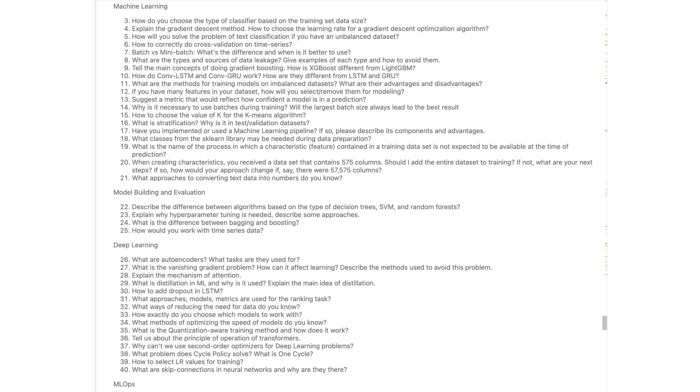
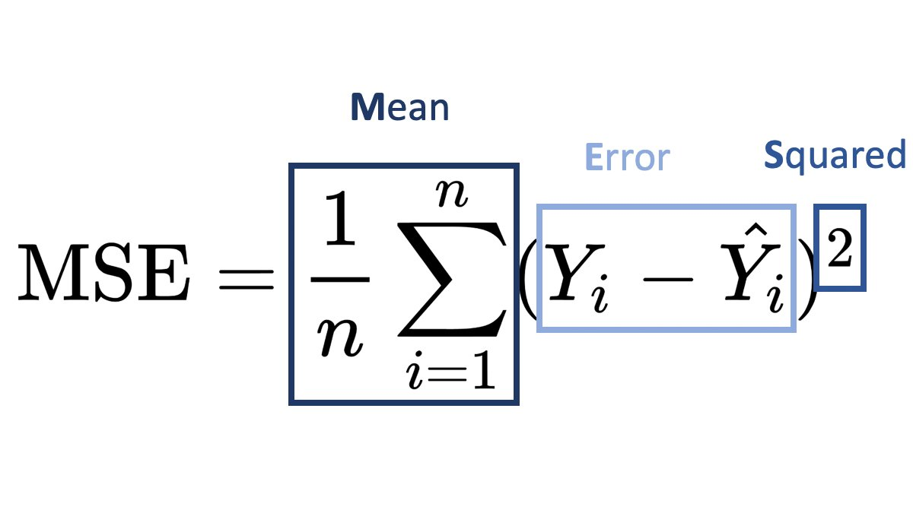
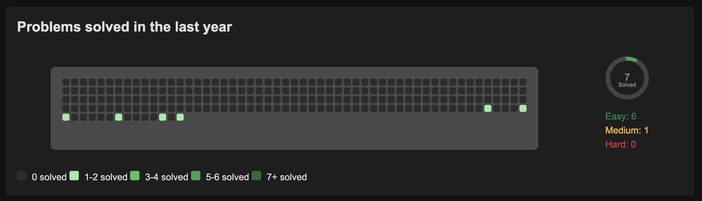

# ML Interview Questions

- Machine Learning
- Model Building and Evaluation
- Deep Learning
- MLOps
- Computer Vision
- Algorithms
- Natural Language Processing
- Manufacturing
- Python

# [deep-ml](https://www.deep-ml.com/) solutions

[Linear Regression Using Gradient Descent](https://www.deep-ml.com/problem/Linear%20Regression%20Using%20Gradient%20Descent)

[Feature Scaling Implementation](https://www.deep-ml.com/problem/Feature%20Scaling%20Implementation)

[Single Neuron with Backpropagation](https://www.deep-ml.com/problem/Single%20Neuron%20with%20Backpropagation)

[Cross-Validation Data Split Implementation](https://www.deep-ml.com/problem/Cross-Validation%20Data%20Split%20Implementation)

[Random Shuffle of Dataset](https://www.deep-ml.com/problem/Random%20Shuffle%20of%20Dataset)

[Decision Tree Learning](https://www.deep-ml.com/problem/Decision%20Tree%20Learning)

[Batch Iterator for Dataset](https://www.deep-ml.com/problem/Batch%20Iterator%20for%20Dataset)

[K-Means Clustering](https://www.deep-ml.com/problem/K-Means%20Clustering)

# Leetcode solutions

# Tree

- [Level order Traversal](https://leetcode.com/problems/binary-tree-level-order-traversal)
- [Zigzag Level Order Traversal](https://leetcode.com/problems/binary-tree-zigzag-level-order-traversal)
- [Minimum Depth of Binary Tree](https://leetcode.com/problems/minimum-depth-of-binary-tree)
- [Binary Tree Right Side View](https://leetcode.com/problems/binary-tree-right-side-view)

# Matrix

- [Number of Islands](https://leetcode.com/problems/number-of-islands)

# Pointers

- [3Sum](https://leetcode.com/problems/3sum)

# Other

- [Merge Intervals](https://leetcode.com/problems/merge-intervals)

